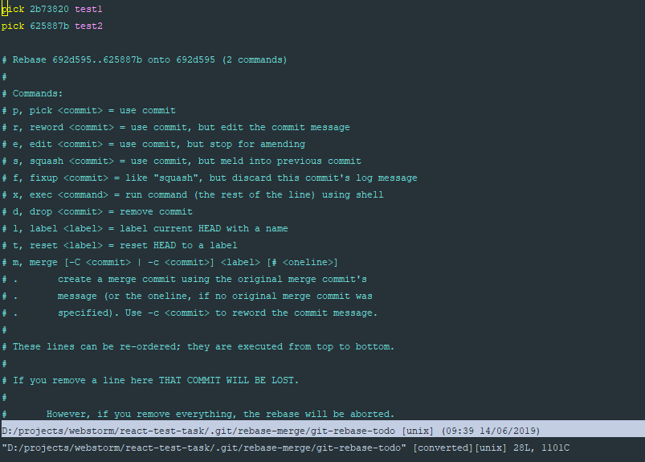
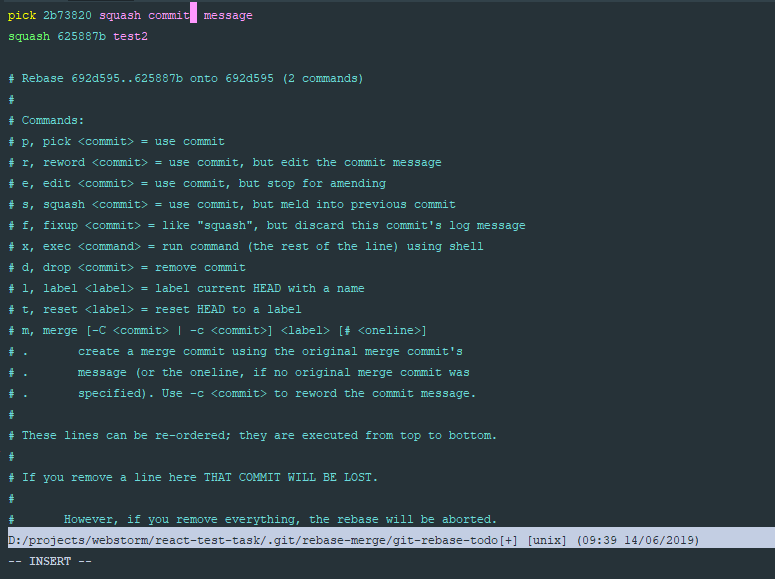
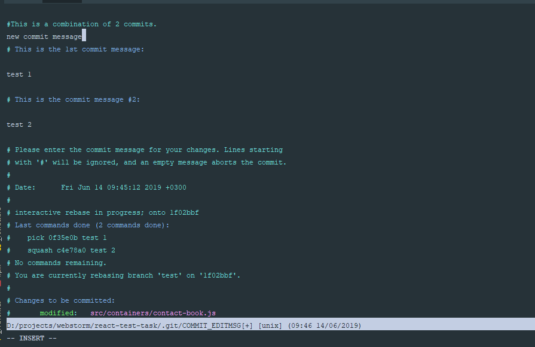

# Squashing Git Commits

## Introduction

We have 2 branch
* master
* feature
We to do 2 commits into feacher branch

## Squash

First of all we must checkout to branch where needed squash commits

```bash
git checkout feature
```

Next step its rebase N-commits

```bash
git rebase -i HEAD~2
```

After input this you'll see list of commits



Rebese `pick` to `squash` in all commits except the first commit



Enter `ESC` key and type `:wq` for save end finish

Next step its write commit message for commit
Type new message on the next line afrer comment #This is a combination of 2 commits.



If you need push new commit into remote repo type in terminal 

```bash
git push -f
```

## Merge into master

```bash
git checkout master
git merge feature
```

## Delete feature branch 

### Delete a local branch

```bash
git branch -d feature
```
### Delete a remote branch
```bash
git push origin --delete feature
```

## Links 

[Basic Vim commands - For getting started](https://coderwall.com/p/adv71w/basic-vim-commands-for-getting-started)
[Always Squash and Rebase your Git Commits](https://blog.carbonfive.com/2017/08/28/always-squash-and-rebase-your-git-commits/)

